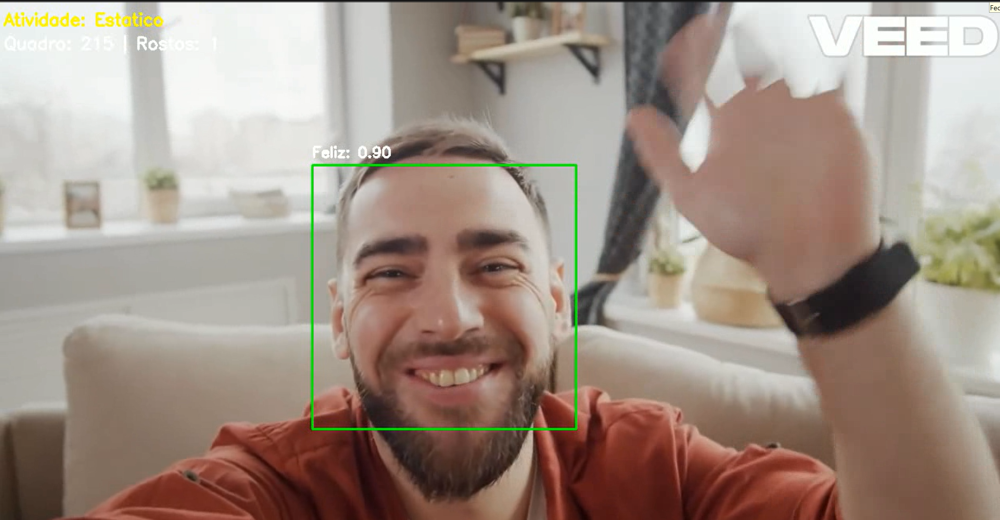

# Análise de Expressões Faciais em Vídeo

## Descrição

Projeto de análise de vídeo e realizar reconhecimento facial, detecção de emoções, identificação de atividades e geração de relatórios automatizados. O projeto utiliza técnicas de visão computacional e aprendizado de máquina.

**Projeto Acadêmico**: FIAP Tech Challenge - Fase 4  
**Curso**: Pós-graduação em Inteligência Artificial para Desenvolvedores  
**Grupo 38**

### Integrantes do Grupo
- **Robson Calixto** - robsoncaliixto@gmail.com
- **Araguacy Pereira** - araguacybp@yahoo.com.br
- **Vinícius Costa** - mcostavini98@gmail.com

---

## Índice

1. [Descrição](#descrição)
2. [Ações Implementadas](#ações-implementadas)
3. [Pré-requisitos](#pré-requisitos)
4. [Instalação](#instalação)
5. [Como Executar](#como-executar)
6. [Variáveis de Ambiente](#variáveis-de-ambiente)
7. [Saídas Geradas](#saídas-geradas)
8. [Referência](#referência)

---

## Ações Implementadas

### Vídeo Anotado
- Geração de vídeo de saída com todas as anotações
- Caixas delimitadoras ao redor de rostos
- Rótulos de emoção com confiança
- Informação de atividade no canto superior
- Contador de frames e rostos detectados
- Geração de relatório consolidado no final da execução

## Pré-requisitos

- **Python**: 3.12 ou superior (obrigatório)
- **uv**: Gerenciador de pacotes Python (recomendado) ou pip
- **Git**: Para clonar o repositório

---

## Instalação

### 1. Instalar uv (Gerenciador de Pacotes)

```bash
# Windows (PowerShell)
powershell -c "irm https://astral.sh/uv/install.ps1 | iex"
```

### 2. Configurar Ambiente Virtual

```bash
.venv\Scripts\activate
```

### 3. Instalar Dependências

```bash
uv pip install -r requirements.txt
```

---

## Como Executar

### Passo 1: Preparar Vídeo de Entrada

Coloque seu vídeo MP4 no diretório `data/`:

```bash
data/
└── video.mp4
```

### Passo 2: Executar o Sistema

#### Execução Básica (Configuração Padrão)

```bash
python -m src.main
```

Esta execução:
- Processa o vídeo em `data/video.mp4`
- Gera saídas em `data/outputs/`
- Cria vídeo anotado e relatório completo

#### Execução com Diretório de Entrada Customizado

```bash
python -m src.main --input caminho/para/seu/video.mp4
```

#### Especificar Diretório de Saída

```bash
python -m src.main --output data/resultados/
```

#### Executar Sem Gerar Vídeo de Saída (Apenas Relatório)

```bash
python -m src.main --no-output-video
```

### Parâmetros da Linha de Comando

| Parâmetro | Tipo | Padrão | Descrição |
|-----------|------|--------|-----------|
| `--input` | PATH | `data/video.mp4` | Caminho do vídeo de entrada |
| `--output` | DIR | `data/outputs/` | Diretório para salvar resultados |
| `--no-output-video` | FLAG | False | Não gerar vídeo anotado (apenas relatório) |

### Exemplo Completo

```bash
# Processar vídeo específico e salvar em diretório customizado
python -m src.main \
  --input videos/meu_video.mp4 \
  --output resultados/analise_01/
```

---

## Variáveis de Ambiente

O sistema utiliza configurações definidas em `config.py`. Não há variáveis de ambiente obrigatórias, mas pode personalizar:

### Configurações Disponíveis

Edite o arquivo `config.py` para ajustar:

```python
# Caminhos
INPUT_VIDEO_PATH = "data/video.mp4"
OUTPUT_DIR = "data/outputs/"
MODELS_DIR = "models/"
...
# Logging
LOG_EVERY_N_FRAMES = 30
```

## Saídas Geradas

### Console Output

Ao executar o sistema, você verá logs detalhados:

```bash
=== Análise de Expressões Faciais em Vídeo ===
Carregando vídeo: data/video.mp4
INFORMAÇÕES DO VÍDEO: 1500 frames | 30.00 FPS | 1920x1080 | 50.00s
...
PROCESSAMENTO CONCLUÍDO!
Total: 1500 frames | 3847 rostos | 300.5s
```

### Arquivos de Saída

- 1. Vídeo Anotado: `data/outputs/output_video.mp4`
- 2. Relatório Textual: `data/outputs/relatorio.txt`

```
============================================================
RELATÓRIO DE ANÁLISE DE VÍDEO
============================================================

Arquivo: Facial_Recognition_Diverse_Activities_Analysis.mp4
Total de Frames: 1500
Duração: 50.00 segundos
FPS: 30.00

--- DETECÇÃO FACIAL ---
Total de Rostos Detectados: 3847

--- ANÁLISE DE EMOÇÕES ---
Happy: 1523 (39.6%)
Neutral: 1154 (30.0%)
Surprise: 577 (15.0%)
Sad: 385 (10.0%)
Angry: 154 (4.0%)
Fear: 38 (1.0%)
Disgust: 16 (0.4%)

--- DETECÇÃO DE ATIVIDADES ---
Moderate Movement: 890 frames (59.3%)
Static: 450 frames (30.0%)
Rapid Movement: 160 frames (10.7%)

Tempo de Processamento: 300.5 segundos
============================================================
```

---

- 3. Exemplo do Vídeo de Saída



---

## Referência

- [**Tech Challenge - Fase 4**](http://github.com/robsoncalixto/fiap-tech-challenge-04/blob/master/doc/Tech%20Challenge%20-%20IADT%20-%20Fase%204.pdf)
- [**FER2013 Dataset**](https://www.kaggle.com/datasets/msambare/fer2013)
- [**OpenCV Optical Flow**](https://docs.opencv.org/4.x/d4/dee/tutorial_optical_flow.html)
- [**FER Library**](https://github.com/justinshenk/fer)
- [**Haar Cascades**](https://github.com/opencv/opencv/tree/master/data/haarcascades)
